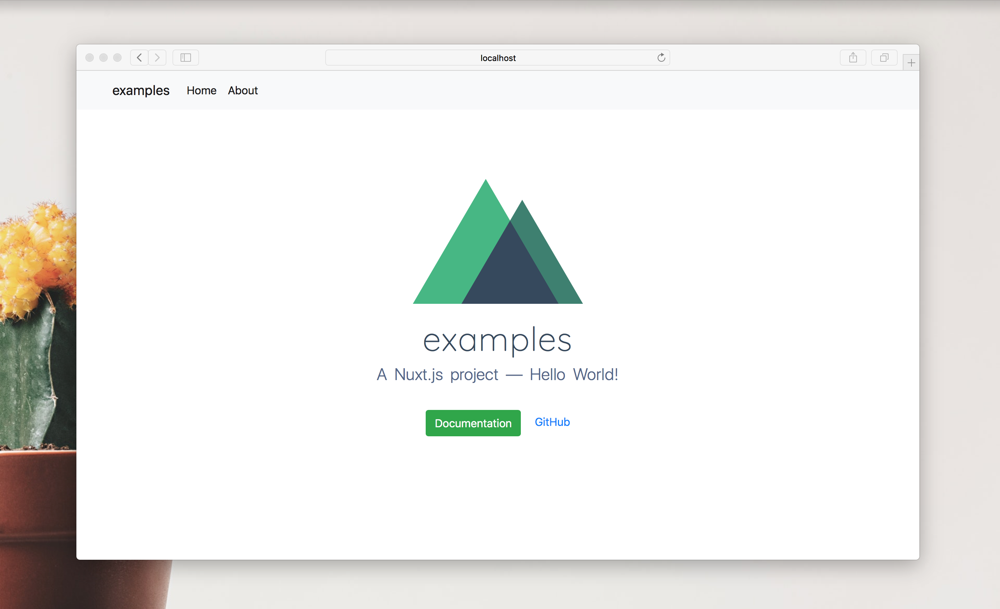

# Nuxt Template

A [Nuxt.js](https://github.com/nuxt/nuxt.js) starter project template without the distraction of a complicated development environment.

## Prerequisites

Make sure to have `node 8.0+` and `npm 5.0+` installed

## Installation

This is a project template for [vue-cli](https://github.com/vuejs/vue-cli).

``` bash
$ vue init muhibbudins/nuxt-template my-project  
$ cd my-project

# install dependencies
$ npm install # Or yarn install
```

> Make sure to use a version of vue-cli >= 2.1 (`vue -V`).

## Usage

### Development

``` bash
# serve with hot reloading at localhost:3000
$ npm run dev
```

Go to [http://localhost:3000](http://localhost:3000)

### Production

``` bash
# build for production and launch the server
$ npm run build
$ npm start
```

### Generate

``` bash
# generate a static project
$ npm run generate
```

## Feature

This template already include with :

- Express Backpack
- Bootstrap Vue
- Axios & Example APIs
- SASS / SCSS Loader
- Vuex Store & Persisted State
- Set Port on Install
